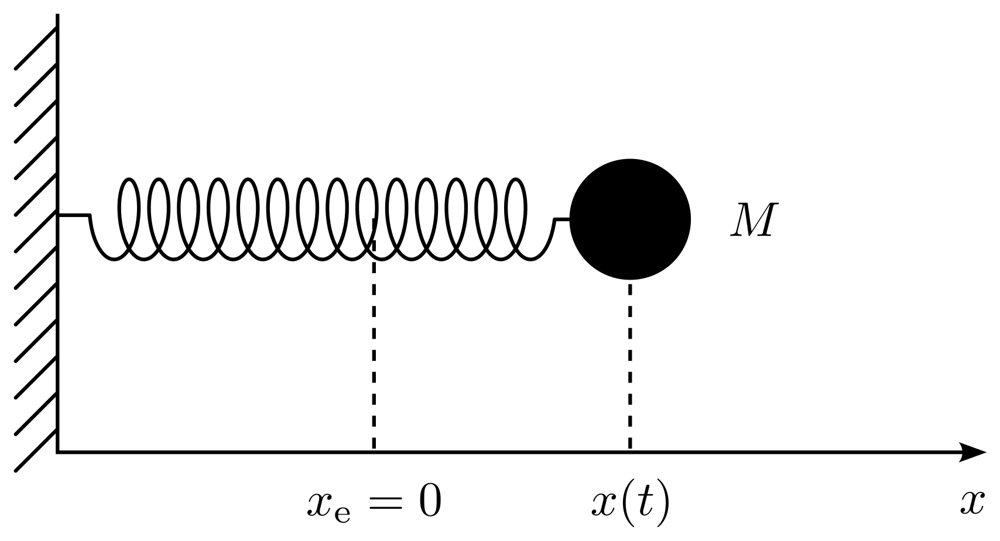

```{css css-format, echo=FALSE}
.header-section-number { display: none; }
body { counter-reset: counter-level-1; }
h1:not(.title) {
  counter-increment: counter-level-1;
  counter-reset: counter-level-2;
}
h1:not(.title)::before{ content: "Aufgabe " counter(counter-level-1) ": "; }
h2 {
  counter-increment: counter-level-2;
  counter-reset: counter-level-3;
}
h2::before { content: counter(counter-level-1) "." counter(counter-level-2) " "; }
```

```{cat abb-tab-eq, engine.opts = list(file = "_bookdown.yml")}
language:
  label:
    fig: 'Abbildung '
    tab: 'Tabelle '
    eq: 'Gleichung '
```

```{r Initialisierung, include=FALSE, message=FALSE, warning=FALSE}
rm(list=ls()) # Loeschen aller Variablen und Funktionen

# Im Folgenden werden notwendige Pakete geladen:
library("rmarkdown")
library("bookdown")
library("knitr")
library("plotrix") # Um Achsen zu «brechen»

```

# Der Lorentz-Oszillator und die lineare Antworttheorie

Der Lorentz-Oszillator ist ein gedämpfter harmonischer Oszillator, der sich in einem eindimensionalen Raum bewegt. Wir betrachten in dieser Übung einen Lorentz-Oszillator, der durch einen äusseren Stimulus angetrieben wird. Der Oszillator unterliegt also den folgenden Kräften: a) einer Rückstellkraft $F_{\mathrm r}=-kx$, b) einer Reibungskraft $F_{\mathrm f}=-f\dot{x}$ und c) einer zeitabhängigen äusseren Kraft $F_{\mathrm{ext}}(t)$. Mögliche physikalische Realisierungen eines Lorentz-Oszillators sind elektrische LC-Schaltungen oder ein an einer Feder befestigter Massenpunkt. Ziel dieser Übung ist es, die lineare Antwort $x(t)$ eines Lorentz-Oszillators auf die Anregung $y(t)=F_{\mathrm{ext}}(t)/M$ am Beispiel eines an einer Feder befestigten Massenpunktes zu untersuchen (siehe Abbildung \@ref(fig:e01a01f01)). In diesem Fall ist die Antwort einfach die momentane Position $x(t)$ des Massenpunktes.

```{r  label = e01a01f01, echo = F, fig.cap = "Mechanischer Lorentz-Oszillator. Die Gleichgewichtslage ist $x_{\\mathrm e}=0$.", out.width = '60%', fig.align='center'}

```

## {#i}
Zeigen Sie, dass die Bewegung des Oszillators durch die Differentialgleichung 
\begin{align}
  \ddot{x}(t)+2\gamma \dot{x}(t)+\omega_0^2 x(t)=y(t) (\#eq:eq-diff)
\end{align}
mit $\omega_0 > 0$ und $\gamma > 0$ beschrieben werden kann. Geben Sie einen Ausdruck der Konstanten $\gamma$ und $\omega_0$ als Funktion von $M$, $k$ und $f$ an.

```{r}

```

## {#ii}
Leiten Sie Ausdrücke für die Arbeit $E_{\mathrm{in}}(t)$, die dem System durch die äussere Kraft bis zum Zeitpunkt $t$ zugeführt wird, für die Energie 
$E_{\mathrm{out}}(t)$, die das System infolge von Reibungsverlusten bis zum Zeitpunkt $t$ in Form von Wärme abgibt und für die Gesamtenergie $E_{\mathrm{osc}}(t)$, die im Oszillator als kinetische und potentielle Energie gespeichert ist. Leiten Sie einen Ausdruck ab, der den Energiehaushalt des Systems beschreibt.

```{r}

```

## {#iii}
Wir betrachten nun die Antwort des Systems auf einen oszillatorischen Stimulus $y(t)=y_0\mathrm e^{-\mathrm i\omega t}$. Wie lautet die allgemeine Lösung der Differentialgleichung \@ref(eq:eq-diff) nach der linearen Antworttheorie?

```{r}

```

## {#iv}
Setzen Sie diese allgemeine Lösung in Gleichung \@ref(eq:eq-diff) ein und leiten Sie einen Ausdruck für die komplexe Suszeptibilität $\chi(\omega)=\chi^{(1)}(\omega)+\mathrm i\chi^{(2)}(\omega)$ des Systems und für den Real- und Imaginärteil $\chi^{(1)}(\omega)$ bzw. $\chi^{(2)}(\omega)$ ab.

```{r}

```

## {#v}
Zeigen Sie mit Hilfe des Superpositionsprinzips, dass die Antwort des Oszillators auf den Stimulus $y(t)=y_0\cos(\omega t)$ die Form $x(t)=A(\omega)\cos(\omega t-\varphi(\omega))$ hat, und leiten Sie Ausdrücke für $A(\omega)$ und $\varphi(\omega)$ her. Prüfen Sie, ob Ihr Ergebnis für $A(\omega)$ die richtige Dimension hat.

*Hinweis*: Verwenden Sie die Beziehung $\cos(a-b) = \cos a\cos b+\sin a\sin b$.

```{r}

```

## {#vi}
Im stationären Zustand wird der durch die treibende Kraft $F_{\mathrm{ext}}=My(t)=My_0\cos(\omega t)$ erzeugte Energiefluss in den Oszillator durch die Energieverluste der verursachten Reibung kompensiert. 

Leiten Sie einen Ausdruck für die zeitlich gemittelte Leistung $\overline{P}$ her, die von der treibenden Kraft auf das System übertragen wird, d.h. für die zeitlich gemittelte Leistung, die vom System aufgenommen wird, und zeichnen Sie diese Funktion schematisch als Funktion der Kreisfrequenz $\omega$ des Stimulus. Erläutern Sie anhand des unter \@ref(iv) abgeleiteten Ergebnisses, warum der Imaginärteil $\chi^{(2)}(\omega)$ der Suszeptibilität manchmal als Absorptionssignal bezeichnet wird.

*Hinweis*: Nehmen Sie den Mittelwert von $P(t)$ über eine Periode $T=\frac{2\pi}{\omega}$.

```{r}

```

## {#vii}
Verwenden Sie die lineare Antworttheorie, um die Antwort $x(t)$ mit der Antwortfunktion $\phi(t)$ für einen Impuls $y(t)=Y_0\delta(t)$ in Beziehung zu setzen, wobei $\delta(t)$ die Dirac'sche Deltafunktion ist. 
Berechnen Sie die Antwortfunktion $\phi(t)$ für den Lorentz-Oszillator. 

*Hinweise*: Ein eleganter Weg, dies zu tun, besteht darin, die Differentialgleichung
\begin{align}
  \ddot{x}(t)+2\gamma \dot{x}(t)+\omega_0^2 x(t)=Y_0\delta(t) (\#eq:eq-diff-delta)
\end{align}
unter Ausnutzung der Tatsache, dass die rechte Seite Null ist für $t>0$, zu lösen.
Verwenden Sie den Ansatz $x(t)=x_0\mathrm e^{\alpha t}$ und bestimmen Sie die allgemeine Lösung der homogenen Differentialgleichung. 
Bestimmen Sie die Lösung, die die Bedingungen $\phi(0)=0$ und $\lim_{t\rightarrow0,t>0}\dot{\phi}(t) = 1$ erfüllt.

```{r}

```

## {#viii}
Die unter \@ref(vii) ausgewertete Antwortfunktion $\phi(t)$ hat die Form
\begin{align}
  \phi(t)={\mathrm e}^{-\gamma t}\dfrac{\sin(\Omega t)}{\Omega},\ \ \ \text{mit}\ \Omega=\sqrt{\omega_0^2-\gamma^2}. \label{response}
\end{align}
Zeichnen Sie die Funktion $\phi(t)$ schematisch für die beiden Fälle $\omega_0 > \gamma$ und $\omega_0 < \gamma$ und erklären Sie, warum $\gamma^{-1}$ manchmal als Relaxationszeit bezeichnet wird.

```{r}

```

## {#ix}
Zeigen Sie für den Fall $\gamma \ll \omega_0$, dass in der Nähe der Resonanzfrequenz des Oszillators (d.h. $\omega\approx \omega_0$), die zeitlich gemittelte absorbierte Leistung $\overline{P}$ (siehe Unteraufgabe \@ref(vi) oben) die Form 
\begin{align}
  \overline{P}\approx \dfrac{My_0^2}{4}\dfrac{\gamma}{(\omega-\omega_0)^2+\gamma^2} (\#eq:power) 
\end{align}
hat.
Diese Kurve ist in der Spektroskopie als Lorentz-Profil bekannt und setzt die Breite einer Linie in einem Spektrum mit der Relaxationszeit in Beziehung. Was ist die volle Breite beim halben Maximum dieses Profils? 

```{r}

```
