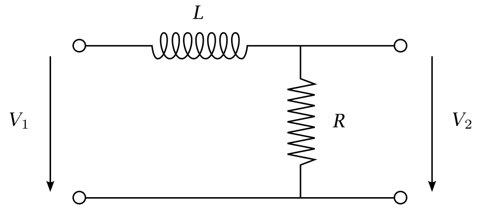
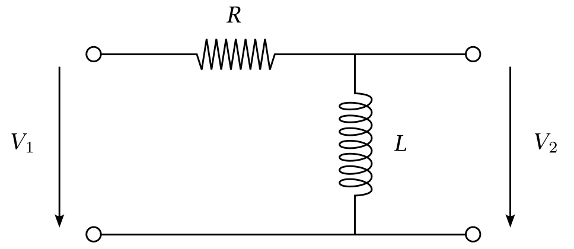
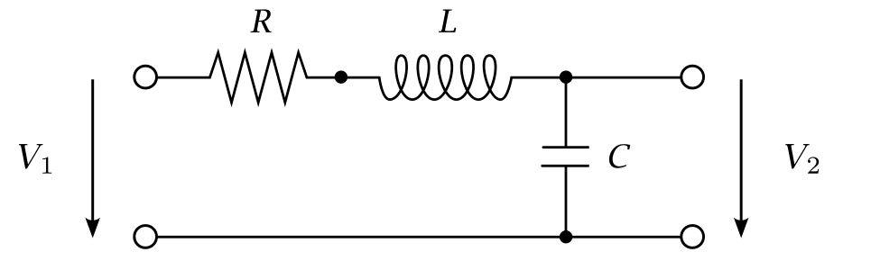

```{css css-format, echo=FALSE}
.header-section-number { display: none; }
body { counter-reset: counter-level-1; }
h1:not(.title) {
  counter-increment: counter-level-1;
  counter-reset: counter-level-2;
}
h1:not(.title)::before{ content: "Aufgabe " counter(counter-level-1) ": "; }
h2 {
  counter-increment: counter-level-2;
  counter-reset: counter-level-3;
}
h2::before { content: counter(counter-level-1) "." counter(counter-level-2) " "; }
```

```{cat abb-tab-eq, engine.opts = list(file = "_bookdown.yml")}
language:
  label:
    fig: 'Abbildung '
    tab: 'Tabelle '
    eq: 'Gleichung '
```

```{r Initialisierung, include=FALSE, message=FALSE, warning=FALSE}
rm(list=ls()) # Loeschen aller Variablen und Funktionen

# Im Folgenden werden notwendige Pakete geladen:
library("rmarkdown")
library("bookdown")
library("knitr")
library("shape")
library("plotrix") # Um Achsen zu «brechen»

knitr::opts_chunk$set(warning=F, message=F, cache=F)

library("gifski")
ishtml=(knitr::pandoc_to()=='html')
dmy <- function(x) {}
```

# RL-Tiefpassfilter {#Aufg1}
Abbildung \@ref(fig:lr-setup) zeigt das Schaltbild eines Tiefpass-Widerstandsinduktionsfilters (RL), bei dem ein Widerstand in Serie mit einer Induktivität geschaltet ist.

```{r  label = lr-setup, echo = F, fig.cap = "Schaltbild eines RL-Tiefpassfilters.", fig.align='center'}

```

Zum Zeitpunkt $t_0=0\,\mathrm{s}$ wird am Eingangsport eine DC-Spannung von $V_1=10\,\mathrm{V}$ angelegt. Dabei benutze man die folgenden Werte: $R=2\,\Omega$ und $L=40\,\mathrm{mH}$.

## `r dmy('1a')` {#A1a}
Bestimmen Sie mit Hilfe der Kirchoffschen Gesetze den durch die Spule induzierten Spannungsabfall $V_{\mathrm L}$ und den Gesamtstrom $I(t)$, wenn der RL-Tiefpassfilter im offenen Kreisbetrieb betrieben wird. Tragen Sie $I(t)$ als Funktion der Zeit auf. Bestimmen Sie den stationären Strom $I_{\mathrm{stat}}$ und die Zeit $t_{\mathrm{stat}}$, nach welcher die Stromstärke $0.999I_{\mathrm{stat}}$ erreicht hat. Bei welchem Vielfachen der Zeitkonstante $\tau$ wird dies erreicht?


## `r dmy('1b')` {#A1b}
Bestimmen Sie die Übertragungsfunktion und zeichnen Sie das Betragsspektrum $M(\omega)$. Bestimmen Sie die Grenzfrequenz $\omega_{\mathrm c}$, die als die Frequenz definiert ist, bei der $\frac{M(\omega)}{M(\omega_0)}=\frac{1}{\sqrt{2}}$ ist. Wie gross ist die Steigung der Hochfrequenzantwort in einer Auftragung von $20\,\lg\left(M(\omega)\right)$ als Funktion von $\lg(\omega)$?


## `r dmy('1c')` {#A1c}
Stellen Sie das Phasenspektrum $\varTheta(\omega)$ dar.
<!-- Beachten Sie, dass die Induktivität eine Phasenverschiebung von 90° gegenüber der Spannung aufweist.  -->


## `r dmy('1d')` {#A1d}
Wir betrachten im Folgenden einen freien Induktionszerfall (FID; gegeben in der Datei `ex5-fid-orig.dat`), der als Input des oben beschriebenen RL-Tiefpassfilters verwendet wird. Der Antwort des RL-Tiefpassfilters auf das Inputsignal ist in Datei `ex5-fid-filt.dat` gegeben. Der FID besteht aus einer Hauptfrequenz $f_1=8\,\mathrm{Hz}$ und einer schwächeren Frequenzkomponente $f_2$. Die Hauptfrequenz $f_1$ entspricht fast genau der Grenzfrequenz $f_{\mathrm c}$ des RL-Tiefpassfilters ($R=2\,\Omega$, $L=40\,\mathrm{mH}$).

Zeigen Sie, dass die Antwort des RL-Filters bezüglich des Inputsignals bei der Frequenz $f_1\approx f_{\mathrm c}$ um $-45^{\circ}$ phasenverschoben ist.

Vergleichen Sie die Spektren des Original-FIDs und des gefilterten FIDs. Versuchen Sie zu erklären, weswegen der «tieferfrequente» Peak im Spektrum durch den Filter unterdrückt wird.


# RL-Hochpassfilter {#Aufg2}
Bei einem RL-Hochpassfilter (siehe Abbildung \@ref(fig:rl-setup)) ist die Reihenfolge der in Reihe geschalteten Widerstände und Induktivitäten einfach umgekehrt angeordnet als bei einem RL-Tiefpassfilter.

```{r  label = rl-setup, echo = F, fig.cap = "Schaltbild eines RL-Hochpassfilters.", fig.align='center'}

```

Benutzen Sie die gleichen Werte für $R$, $L$ und $V_1$ wie in Aufgabe \@ref(Aufg1).

Zeichnen Sie das Betragsspektrum $M(\omega)$ und das Phasenspektrum $\varTheta(\omega)$ des RL-Hochpassfilters.


# Filter 2. Ordnung {#Aufg3}
Oft werden Filter höherer Ordnung verwendet, um «steilere» Antworten als $20\,\mathrm{dB/Dekade}$ zu erhalten. Dies wird erreicht, indem eine Schaltung mit einem Widerstand und zwei Energiespeicherkomponenten, d. h. Induktoren oder Kondensatoren, konstruiert wird. Ein Beispiel für ein Filter zweiter Ordnung ist eine RLC-Serienschaltung, bei der ein Widerstand, eine Spule und ein Kondensator in Reihe geschaltet sind, wobei die Spule vor dem Kondensator liegt (siehe Abbildung \@ref(fig:rlc-setup)).

```{r  label = rlc-setup, echo = F, fig.cap = "Schaltbild eines RLC-Serienschaltung.", fig.align='center'}

```

Stellen Sie für diese Schaltung das Betragsspektrum $M(\omega)$ mit den Werten $V_1=10\,\mathrm{V}$, $R=2\,\Omega$, $L=50\,\mathrm{mH}$ und $C=200\,\mathrm{nF}$ graphisch dar. 
Bestimmen Sie einen analytischen Ausdruck für die Zentralfrequenz $\omega_{\mathrm z}$, bei der das Betragsspektrum $M(\omega)$ maximal ist.
Beschreiben Sie die Eigenschaften dieses Filters und wie sich die Übertragungsfunktion bei verschiedenen Werten von $R$, $C$ und $L$ ändert (d.h. ändern Sie den Wert einer dieser Parameter und halten Sie die anderen beiden Parameter konstant).

